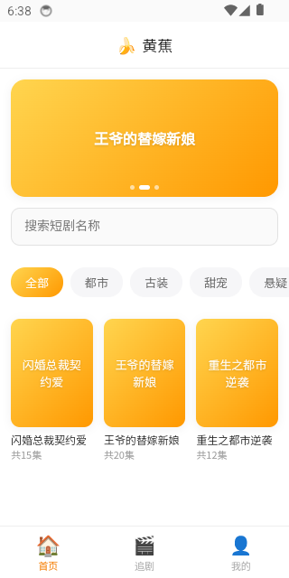

# 黄蕉短剧系统

用 Vue3 + Python 3.11(FastAPI) 搭建的短剧付费观看系统 MVP，用户端、管理后台、后端代码都在本目录下。



## 已实现（MVP）

- 手机号 + 密码注册/登录（JWT），短信验证码走 mock provider
- 短剧分类、列表、搜索、详情
- 分集播放 + 锁集逻辑：前 N 集免费，之后需要 VIP 或花币解锁全剧
- VIP 套餐购买（mock 支付，点击即到账）
- 币充值（mock 支付）、解锁全剧扣币
- 收藏、观看记录（追剧页）
- 钱包流水
- 用户中心
- **每日签到**：连续签到 7 天一个周期，奖励递增，断签重新计数；月历视图展示签到记录
- **积分任务**：每日任务（可配置每日完成次数上限）+ 一次性任务，完成即到账（mock，类似广告观看/分享目前都是点击按钮直接算完成，真实广告 SDK/分享回调接入后可复用同一套任务判定逻辑）
- **卡密兑换**：管理后台批量生成卡密（VIP 天数 / 币，可选有效期），用户输入兑换，一码一用
- **分享赚钱 / 分销商体系**：注册邀请码 + 两级返佣（直推/间推），好友付费（VIP/充值）自动按比例给上级记佣金；提现需先绑定收款账户（支付宝/微信/银行卡），申请后管理端人工审核打款或驳回退款
- **分享海报生成**：纯前端 canvas 绘制带二维码的推广海报（品牌背景+邀请码+二维码，二维码指向带 invite 参数的注册链接），点击按钮导出 PNG 保存到本地，无需后端参与
- **原生 App（iOS/Android）**：用 Capacitor 给用户端 H5 套壳，不是重写，`frontend` 目录下的 Vue3 代码原样复用；原生工程在 `frontend/ios/` 和 `frontend/android/`。已在 iOS 模拟器和 Android 模拟器上分别装包、启动、实机走通首页→详情页的完整流程并截图验证，两边都能正确显示中文和真实接口数据。详见下方"原生 App"章节
- **App 版本更新提示**：原生 App 启动时用 `@capacitor/app` 读取本机安装的包版本号，和 `/app-versions/latest?platform=` 返回的最新版本比对，有更新则弹窗（非强制更新可点"以后再说"关掉，强制更新只有"立即更新"按钮、不可通过点击遮罩关闭）；纯 Web 端不会触发（`Capacitor.isNativePlatform()` 为 false 时直接跳过检查），不影响浏览器访问
- **免广告会员**：和 VIP 相互独立的付费产品，购买后短剧详情页的广告位消失（mock 广告位，点击引导去开通）
- **静态法律/说明页**：用户协议、隐私政策、关于我们、VIP说明，固定 4 个 slug，后台用富文本编辑器（`@vueup/vue-quill`）编辑，支持加粗/斜体/标题/列表/链接/图片；前端用 `DOMPurify` 净化后再渲染（内容只有管理员能改，但净化是防御性的一层保险），页面本身无需登录即可访问
- **意见反馈**：用户提交反馈（文字+联系方式+图片），后台收件箱可按状态筛选并回复，用户在"我的反馈"里能看到官方回复
- **演员/演职员信息**：短剧详情页展示演员/导演列表（头像/饰演角色/简介）
- **短剧壁纸图集**：每部剧独立的剧照/壁纸相册，带下载次数统计
- **管理员账号管理**：新增/提升/取消管理员（不能取消自己），不再只有种子数据里那一个初始账号
- **操作日志**：记录敏感操作（管理员账号变更、用户余额/会员调整、卡密批量生成、提现审核通过/驳回），常规内容 CRUD 不记录（已有 updated_at 可追溯，逐条记录价值低）
- **收藏/追剧记录后台查看**：运营可看到全站用户的收藏和观看进度列表
- **首页焦点图**：首页轮播 banner（自动轮播+圆点指示），点击可跳转站内短剧详情或外部链接，后台可增删改+排序+启停
- **敏感词过滤 / 违禁词检测工具**：用户提交昵称/意见反馈时自动校验违禁词库，命中即拒绝提交；管理后台发布短剧时提供"内容检测"按钮人工核查标题/简介（不强制拦截，供参考）；违禁词库后台可增删
- **SEO 关键词提取**：短剧编辑页"提取关键词"按钮用 `jieba` 对标题+简介做 TF-IDF 分词提取，结果回填到可编辑的关键词字段，管理员可再手动调整；保存后关键词随详情接口下发，用户端详情页据此设置 `<meta name="keywords">` 和页面 `<title>`，和上面基于子串匹配的违禁词过滤是两套独立逻辑
- **搜索日志 / 热搜统计**：用户搜索短剧关键词自动记录（游客也记，不强制登录），首页展示热搜标签点击即可填入搜索框；管理后台可看全量搜索日志和热搜排行
- **App 版本管理**：后台可维护各平台（Android/iOS/微信小程序）版本记录（版本号/版本码/是否强制更新/更新说明/下载地址），并有一个公开的"查最新版本"接口；v3 目前是纯 H5，没有原生壳/小程序去消费这个接口触发更新弹窗，先把管理能力建好
- **系统配置中心**：通用键值配置表，后台可增删改任意配置项，无需为每个新设置加数据库字段；预置了 `site_name`/`customer_service_contact`/`icp_number`/`maintenance_mode` 四项，其中 `maintenance_mode` 是真正接入生效的——设为 `on` 后用户端整体切换成维护页面，不是摆设配置
- **管理后台**：数据看板、首页焦点图管理、分类管理、短剧/分集/演职员/壁纸图集管理（增删改+上下线）、VIP 套餐管理、免广告套餐管理、签到奖励配置、积分任务管理（增删改+启停）、卡密管理（批量生成、按状态筛选、删除未使用卡密）、分销配置（返佣比例、提现规则）、提现审核（通过/驳回）、静态页面编辑、意见反馈处理、管理员账号管理、操作日志、收藏/追剧记录查看、违禁词管理、搜索日志/热搜排行、App 版本管理、系统配置、观看行为埋点看板（剧目总观看/游客vs登录用户拆分、分集观看明细）、用户管理（搜索、调整余额/延长会员/延长免广告，含邀请码和佣金余额展示）、订单管理（会员订单/免广告订单/充值订单只读列表）

已用浏览器走通全流程：用户端注册 → 充值 → 购买 VIP → 详情页/播放页锁集状态实时反映；管理端登录 → 建分类/短剧/分集 → 用户余额调整，均验证通过。分销闭环也已走通：用户 A 邀请用户 B 注册 → B 购买 VIP → A 的佣金余额和团队列表实时更新 → A 绑定收款账户并申请提现 → 管理端审核通过/驳回（驳回自动退回佣金余额）。

## 明确未实现（先记录，后续再做）

完整差距清单，按优先级排列，做完一项在前面打勾：

### 内容/业务类（用户能感知到）

- [x] ~~签到 / 积分任务 / 卡密兑换 / 分销体系+提现~~（已完成，见上方"已实现"）
- [x] ~~免广告会员~~（已完成，见上方"已实现"）
- [x] ~~静态法律/说明页~~（已完成，见上方"已实现"，现已升级为富文本编辑，见下方"富文本 WYSIWYG 编辑器"）
- [x] ~~意见反馈~~（已完成，见上方"已实现"）
- [x] ~~演员/演职员信息~~（已完成，见上方"已实现"）
- [x] ~~短剧壁纸图集~~（已完成，见上方"已实现"）
- [x] ~~首页焦点图/广告位~~（已完成，见上方"已实现"）
- [x] ~~敏感词过滤~~（已完成，见上方"已实现"，同时覆盖了下面运营工具类的"违禁词检测工具"，两者共用同一套违禁词库）
- [x] ~~App 版本更新提示~~（已完成，见上方"已实现"）
- [x] ~~分享海报生成~~（已完成，见上方"已实现"）
- [ ] **提现打款接真实渠道**：管理端"通过"目前只是标记状态，需要人工在支付宝/微信/银行后台手动转账——这是提现本身的性质决定的，不是遗漏

### 后台运营工具类（用户看不到，店主/运营会需要）

- [x] ~~管理员账号增删 + 操作日志~~（已完成，见上方"已实现"）
- [x] ~~收藏/追剧记录的后台查看页面~~（已完成，见上方"已实现"）
- [x] ~~违禁词检测工具~~（已完成，和敏感词过滤共用同一套违禁词库；关键词提取部分未做）
- [x] ~~搜索日志/热搜统计~~（已完成，见上方"已实现"）
- [x] ~~App 版本管理后台~~（已完成，见上方"已实现"；配套的"更新提示弹窗"仍未做，见上方内容/业务类）
- [x] ~~通用系统配置中心~~（已完成，见上方"已实现"）
- [x] ~~富文本 WYSIWYG 编辑器~~（已完成，静态页面管理已升级为 Quill 编辑器，见上方"已实现"）
- [x] ~~观看行为埋点看板~~（已完成，见上方"已实现"）
- [x] ~~违禁词关键词提取~~（已完成，见上方"已实现"；命名沿用旧清单，实际是独立的 SEO 关键词提取功能，和违禁词过滤不共用逻辑）

### 平台特定集成——大概率不需要（v3 不跑在微信/抖音小程序生态里）

- 微信公众号自动回复/菜单/素材库
- 抖音/微信小程序媒资同步、小程序虚拟支付
- 微信扫码登录、JSSDK
- 小程序广告位开关

## 第三方服务：预留接口，未接真实账号

`backend/app/services/` 下三个抽象层，当前都只有 mock 实现：

- `payment.py`：`PaymentProvider`，mock 版本创建订单后立即视为支付成功。要接微信支付/支付宝，在 `WechatPayProvider` / `AlipayProvider` 里实现 `charge()`，并处理异步回调。
- `sms.py`：`SmsProvider`，mock 版本只把验证码打到后端日志，不真实发送。
- `storage.py`：`StorageProvider`，mock 版本存本地 `backend/uploads/` 目录。要接阿里云 OSS 之类，实现 `AliyunOSSProvider.save()`。
  管理后台的短剧封面、分集播放地址都已经接了这个上传接口（`admin/src/views/VideoEdit.vue`），点"上传图片/上传视频"直接选文件即可，上传后端点当前存本地磁盘并返回相对路径 `/uploads/xxx`，正式环境建议切到 OSS 存储，否则视频文件会占满服务器磁盘、也没有 CDN 加速。

对应的密钥配置位都已经在 `backend/.env.example` 里占好位置（`PAYMENT_PROVIDER` / `SMS_PROVIDER` / `STORAGE_PROVIDER` 等），改成对应值即可切换。

## 技术选型

- 后端：Python 3.11 + FastAPI + SQLAlchemy 2.0（async）+ SQLite（默认，改 `DATABASE_URL` 即可切 MySQL/Postgres）+ JWT 鉴权
- 用户端前端：Vue3 + Vite + Pinia + Vue Router + Axios，移动端 H5 单页应用
- 管理后台前端：Vue3 + Vite + Element Plus，桌面端单页应用，独立于用户端部署

## 目录结构

```
duanju-v3/
├── backend/
│   ├── app/
│   │   ├── main.py          # FastAPI 入口
│   │   ├── core/             # 配置、JWT/密码工具
│   │   ├── db/                # 数据库连接
│   │   ├── models/           # SQLAlchemy 模型（含 User.is_admin 管理员标记）
│   │   ├── schemas/          # Pydantic 请求/响应模型（admin.py 是管理后台专用）
│   │   ├── api/v1/endpoints/ # 路由：auth/users/videos/orders/uploads/admin
│   │   ├── services/         # 支付/短信/存储的抽象层（mock）
│   │   └── seed.py            # 开发用演示数据 + 初始管理员账号
│   ├── requirements.txt
│   └── .env.example
├── frontend/                  # 用户端
│   ├── src/
│   │   ├── views/             # 登录/注册/首页/详情/播放/VIP/充值/我的/追剧
│   │   ├── components/       # TabBar、VideoCard
│   │   ├── stores/            # Pinia：用户状态
│   │   ├── api/                # axios 封装 + 接口定义
│   │   └── router/
│   └── vite.config.js         # dev 环境代理 /api 到后端 8811 端口
├── admin/                     # 管理后台
│   ├── src/
│   │   ├── views/             # 登录/看板/分类/短剧+分集/套餐/用户/订单
│   │   ├── layouts/           # 侧边栏 + 顶栏布局
│   │   ├── stores/            # Pinia：管理员登录态
│   │   ├── api/
│   │   └── router/            # 路由守卫会校验 is_admin，非管理员踢回登录页
│   └── vite.config.js         # dev 端口 5174，同样代理 /api 到后端 8811
└── android-native/            # 原生 Android（Kotlin+Compose），和 frontend/android 的 Capacitor 套壳方案并存、互不依赖
    └── app/src/main/java/com/huangjiao/duanju/android/
        ├── data/               # Retrofit 接口、数据模型、SessionManager（token 持久化）
        └── ui/                 # Compose 页面：登录/注册/首页/详情/播放
```

## 本地运行

后端（用户端和管理后台共用同一个后端）：

```bash
cd backend
python3 -m venv venv && source venv/bin/activate
pip install -r requirements.txt
cp .env.example .env   # 按需修改，默认 SQLite 直接能跑
uvicorn app.main:app --reload --port 8811
```

首次启动会自动建表并写入演示数据（管理员账号 + 3 部短剧 + 分类 + VIP 套餐）。

**关于密钥/密码（开源仓库不带任何默认凭证）**：
- `SECRET_KEY`（JWT 签名密钥）不设默认值。`.env` 里留空时，开发模式会自动生成一个临时密钥（每次重启进程都会换，之前签发的 token 全部失效）；生产模式（`DEBUG=false`）留空会直接拒绝启动，报错里会给你一个可以直接用的随机值。
- **初始管理员账号**：手机号固定是 `.env` 里的 `ADMIN_PHONE`（默认 `13800000000`），密码取 `ADMIN_PASSWORD`；留空的话首次启动会随机生成一个，**只在后端日志里打印这一次**，看日志拿到密码后登录管理后台改掉。正式部署建议直接在 `.env` 里写死一个强密码。

用户端前端：

```bash
cd frontend
npm install
npm run dev   # http://localhost:5173
```

管理后台前端：

```bash
cd admin
npm install
npm run dev   # http://localhost:5174
```

打开 http://localhost:5173 体验用户端：注册账号 → 看免费集 → 充值/开通VIP解锁后续集数。
打开 http://localhost:5174 用初始管理员账号登录管理后台：建分类 → 建短剧 → 加分集 → 上线，用户端刷新即可看到。

## App 壳（iOS/Android，Capacitor 套壳 Vue3）

用户端 H5 套了一层 [Capacitor](https://capacitorjs.com/) 壳，不是重写——`frontend` 目录下的 Vue3 代码原样复用，打包时把构建产物塞进原生 WebView，额外获得可安装的 App 图标、上架商店的能力、以及按需接入原生 API（相机/推送等）的扩展空间。原生工程已生成在 `frontend/ios/` 和 `frontend/android/`（随仓库一起提交，可直接打开）。

（另外还有一套**真正原生重写**的 Android 客户端，见下方"原生 Android"一节，和这套 Capacitor 方案并存、互不依赖，各有取舍。）

**关键前提：原生 App 里"相对路径"会失效。** Web 版接口用 `/api/v1` 相对路径，靠和后端同源蹭到根路径；原生 App 跑在 `capacitor://localhost`（iOS）或 `http://localhost`（Android）这种壳自己的地址下，没有"同源"这回事，必须显式配置后端的完整地址：

```bash
cd frontend
echo "VITE_API_BASE_URL=https://your-backend-domain.com/api/v1" > .env.production.local
npm run build:native   # vite build + npx cap sync，把构建产物同步进两个原生工程
```

（本地真机/模拟器调试可以用 Capacitor 的 live-reload 模式，把 `capacitor.config.json` 临时加一段 `server`，指向本机跑着的 `npm run dev`，改完代码原生 App 里直接刷新可见，不用每次重新构建；调完记得把这段配置删掉，正式包不能带 live-reload 指向开发机。**iOS 模拟器和 Android 模拟器指向"开发机自己"的地址不一样**——iOS 模拟器和 Mac 共用网络栈，`http://localhost:5173` 直接能通；Android 模拟器是独立的虚拟机，必须用 `http://10.0.2.2:5173` 这个特殊别名才能访问到宿主机）：

```json
"server": { "url": "http://localhost:5173", "cleartext": true }
```

打开原生工程：

```bash
npx cap open ios       # 用 Xcode 打开，需要 Xcode + 一个 Apple 开发者账号（真机调试/上架用）
npx cap open android   # 用 Android Studio 打开，需要 Android SDK
```

也可以纯命令行构建+跑模拟器，不开 IDE（这套仓库就是这么验证的）：

```bash
# iOS：构建 + 装进已启动的模拟器
cd ios/App
xcodebuild -project App.xcodeproj -scheme App -sdk iphonesimulator \
  -destination "platform=iOS Simulator,name=iPhone 17" -derivedDataPath build build
xcrun simctl boot "iPhone 17"
xcrun simctl install "iPhone 17" build/Build/Products/Debug-iphonesimulator/App.app
xcrun simctl launch "iPhone 17" com.huangjiao.duanju

# Android：构建 debug APK 需要 JDK 21（不是随便一个 JDK 都行，装老版本会报「无效的源发行版：21」）
cd android
echo "sdk.dir=/path/to/android-sdk" > local.properties
JAVA_HOME=/path/to/jdk-21 ./gradlew assembleDebug
adb install -r app/build/outputs/apk/debug/app-debug.apk
adb shell am start -n com.huangjiao.duanju/.MainActivity
```

已知的模拟器环境限定问题（不是代码 bug，换真机/换个装了完整语言包的模拟器就没有）：某些 iOS 模拟器运行时缺少中文字体资源，WKWebView 渲染中文会显示方块问号——同一个页面在 Safari 里访问也是这样，说明是模拟器本身的字体资源缺失，不是 App 或代码的问题；真机和大多数正常配置的模拟器不会有这个问题（本仓库在 Android 模拟器上验证中文渲染完全正常）。

图片/视频这类后端返回的资源地址（短剧封面、分集播放地址、壁纸、反馈图片、收款码）在本地存储模式下是相对路径（`/uploads/xxx`），前端统一走 `frontend/src/utils/assetUrl.js::resolveAssetUrl()` 补全成绝对地址——Web 端这个函数是空操作（相对路径本来就能用），原生端会自动拼上 `VITE_API_BASE_URL` 的 origin。如果后端切到了真实对象存储（OSS 等），上传接口本来就会返回绝对 URL，这层拼接会被跳过，不会出错。

App 名称/Bundle ID：`黄蕉短剧` / `com.huangjiao.duanju`，在 `frontend/capacitor.config.json` 里改。

**图标/启动图**：已经换成品牌配色（`#ffd54f→#ff9800` 渐变）+ 🍌 的自制图标，不再是 Capacitor 默认占位图。源图在 `frontend/assets/`（`icon.png` 1024×1024，`splash.png`/`splash-dark.png` 2732×2732），改完源图后跑：

```bash
cd frontend
npm run gen:icons   # capacitor-assets generate --ios --android，批量生成两端所有尺寸的图标和启动图
```

要用真实设计稿替换时，直接覆盖 `frontend/assets/` 下的三个文件再跑上面这条命令即可，不用手动处理各种 DPI 目录。

## 原生 Android（Kotlin + Jetpack Compose，独立于上面的 Capacitor 方案）

`android-native/` 是一个**从零写的真原生 Android 客户端**，不经过 WebView，用 Kotlin + Compose 直接对接现有 FastAPI 后端。和上面的 Capacitor 套壳方案完全独立、并存，包名也不同（`com.huangjiao.duanju.android` vs Capacitor 版的 `com.huangjiao.duanju`），两个 App 能同时装在一台设备上对比。

已经覆盖了 Web 端除少数边缘功能外的完整用户侧体验：核心看剧流程（注册/登录 → 首页列表/搜索/分类 → 短剧详情+收藏 → 分集播放+观看进度上报，含锁集逻辑）、底部导航（首页/追剧/我的）、账号与激励功能（签到、积分任务、卡密兑换、VIP购买、免广告购买、充值、意见反馈+传图、401自动登出）、分销推广（团队/佣金/邀请码）、提现（支付宝/微信/银行卡，微信收款码图片上传走系统相册选择器+Retrofit multipart，不需要额外的存储权限）。详见 [`android-native/README.md`](android-native/README.md)（技术栈、本地运行、`10.0.2.2` vs `localhost` 这类模拟器网络坑、以及和 Capacitor 版怎么选）。
