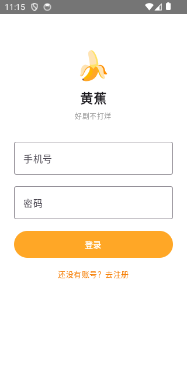
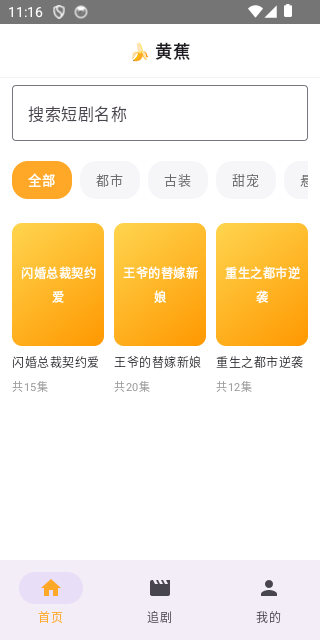
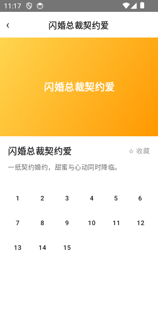
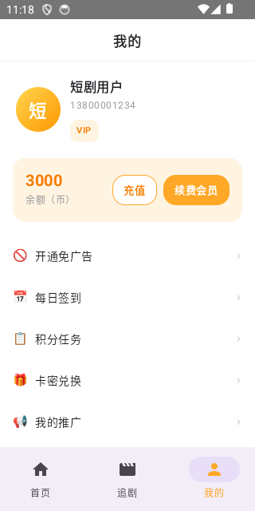
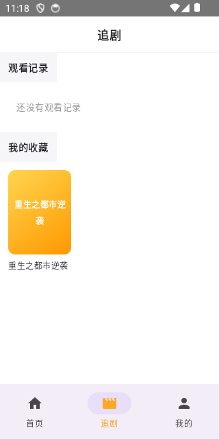

# 黄蕉短剧 · 原生 Android（Kotlin + Jetpack Compose）

这是一个**真正的原生 Android 客户端**，用 Kotlin + Jetpack Compose 从零实现界面和业务逻辑，不依赖 WebView，和 `frontend/android`（Capacitor 给 Vue3 H5 套壳的方案）是两套完全独立、并存的实现，互不影响、互不依赖。

包名 `com.huangjiao.duanju.android`，和 Capacitor 版（`com.huangjiao.duanju`）不同，两个 App 可以同时装在同一台设备/模拟器上共存，方便对比测试。

<p>
  
  
  
  
  
</p>

## 当前范围

**第一轮（核心看剧流程）：**

- 注册 / 登录（JWT，token 用 DataStore 持久化，冷启动自动恢复登录态）
- 首页：短剧列表、按分类筛选、关键词搜索、热搜标签
- 短剧详情：简介、免费集数提示、分集网格（锁集状态一目了然）
- 分集播放：ExoPlayer 播放 HLS(.m3u8) 视频源，未解锁的集显示锁定提示而非播放器，播放失败会显示友好提示而不是白屏/崩溃

**第二轮（底部导航 + 账号基础功能）：**

- 底部 Tab 栏（首页/追剧/我的），和 Web 端 `TabBar` 一致，只在这三个一级页面显示
- 追剧页：观看记录 + 我的收藏（复用首页同一套 `VideoListItem`/`VideoCard`）
- 我的页：头像/昵称/手机号、VIP・免广告徽章、币余额、退出登录
- 短剧详情页收藏按钮（★ 已收藏 / ☆ 收藏，实时调用收藏接口）

**第三轮（付费/激励功能 + 网络健壮性）：**

- 每日签到（连续签到streak + 7天奖励规则 + 本月日历）
- 积分任务（daily/once 两种类型，含每日进度显示）
- 卡密兑换（VIP天数/余额币两种类型）
- 意见反馈（提交 + 历史列表 + 官方回复展示，暂不支持图片上传）
- VIP 购买、币充值（mock 支付，一次性到账）
- 观看进度上报：播放页每 5 秒上报一次播放进度（对应 web 端 `timeupdate` 节流上报），追剧页"观看记录"依赖这个才会有数据
- **401 自动登出**：网络层现在会拦截 401 响应，清掉本地 token 并跳回登录页，不再是静默失败+假装还登录着的状态（实测：手动重启后端换新 `SECRET_KEY` 使 token 失效，App 在下一次请求时自动跳回登录页，无需手动"退出登录"）

**第四轮（分销体系 + 免广告）：**

- 免广告会员购买（AdFreeScreen，和 VIP 购买几乎同构，独立付费项）
- 我的推广（DistributionScreen）：佣金统计（可提现/累计/直推间推人数）、邀请码展示+复制、团队列表（直推/间推标签）、佣金记录
- 提现（WithdrawScreen）：收款账户绑定、提现规则展示、申请提现、提现记录列表

**第五轮（文件上传基础设施 + 一个真实 UI bug 修复）：**

- 图片上传基础设施：`ActivityResultContracts.PickVisualMedia`（系统相册选择器，不需要申请存储权限）+ Retrofit multipart（`data/remote/UploadHelper.kt::uploadImageUri()`，把选中的 `content://` Uri 读成临时文件传给 `POST /uploads`）+ 本地缩略图预览（`MediaStore.Images.Media.getBitmap` 直接解码本地 Uri，不等服务器返回就能看到预览，没有另外引入 Coil 这类图片库）
- 提现收款账户补上"微信"选项：选收款码图片 → 本地缩略图预览 → 点保存时才真正上传 → 拿到手的 URL 一起提交
- 意见反馈补上图片（最多 9 张，复用同一套上传逻辑）
- **真实 bug 修复**：随着"我的"页菜单项一轮轮变多，整个页面用的是不可滚动的 `Column`，最下面的"意见反馈"和"退出登录"在小屏幕上直接被挤出屏幕之外，完全点不到——这是这一轮测试时才实际发现的，加了 `verticalScroll` 修掉

**还没做**：目前想不到明显的功能缺口了，`android-native` 已经覆盖了 Web 端除了少数边缘功能外的完整用户侧体验。

## 已知模拟器踩坑记录（不是代码 bug，纯环境问题）

- 内存吃紧的机器上，Android 模拟器容易出现 "System UI isn't responding" / "Process system isn't responding" 假死——构建完先跑 `./gradlew --stop` 把空闲的 Gradle 守护进程杀掉再开模拟器，能明显缓解。真遇到了就点 "Wait" 等它自己恢复，不用怀疑是代码问题。
- 软键盘弹出时，输入法的联想词候选栏会盖住下一个输入框的顶部——如果用 `adb shell input tap` 紧贴着候选栏位置点"下一个字段"，容易点到候选词上把文字插错地方。改用 `adb shell input keyevent KEYCODE_TAB` 切换到下一个字段，不会有这个问题。
- `adb shell input text` 不支持中文（是 adb 工具本身的限制，会在被测 App 所在进程之外的地方抛 `NullPointerException`，不是应用崩溃），测中文输入内容要么用 ASCII 占位文本测功能，要么直接用 API 提前造数据。

## 技术栈

- Kotlin 2.0 + Jetpack Compose（Material 3）+ Navigation Compose
- Retrofit + OkHttp + kotlinx.serialization（网络层，直接对接现有 FastAPI 后端的 `/api/v1` 接口，不需要后端做任何改动）
- DataStore Preferences（token 持久化，对应 Web 端 localStorage 存 token 的角色）
- Media3 ExoPlayer（含 HLS 扩展）播放短剧视频

## 本地运行

需要：Android SDK（`compileSdk 36`）、JDK 21（**注意不是随便什么 JDK 都行**，用旧版本 JDK 编译会报 `无效的源发行版：21`）。

```bash
cd android-native
echo "sdk.dir=/path/to/android-sdk" > local.properties
JAVA_HOME=/path/to/jdk-21 ./gradlew assembleDebug
adb install -r app/build/outputs/apk/debug/app-debug.apk
adb shell am start -n com.huangjiao.duanju.android/.MainActivity
```

**后端地址**：`app/build.gradle.kts` 里 `API_BASE_URL` 默认是 `http://10.0.2.2:8811/api/v1`——`10.0.2.2` 是 Android 模拟器访问宿主机的专用地址（注意不是 `localhost`，和 iOS 模拟器不一样，iOS 模拟器可以直接用 `localhost`）。真机调试或正式发布前改成局域网 IP / 真实后端域名。

后端要跑在 `0.0.0.0` 而不是 `127.0.0.1` 才能被模拟器访问到：

```bash
cd ../backend
uvicorn app.main:app --host 0.0.0.0 --port 8811
```

## 和 Capacitor 版（`frontend/android`）该怎么选

两个都留着，不是谁取代谁：

- **Capacitor 版**：复用 Vue3 代码，改动小、迭代快，Web 端加了新页面原生这边几乎零成本同步，缺点是本质是 WebView，交互体验和启动速度不如纯原生。
- **原生版（这个目录）**：真正的原生渲染和交互，体验更好，但每个页面都要重写一遍，两端（iOS/Android）功能要分别维护，工作量大很多。

如果后续要长期维护原生版，功能对齐是个持续过程，不建议一次性把 Web 端全部功能搬过来——参照这一轮"先做核心看剧流程"的节奏，一批一批加。
